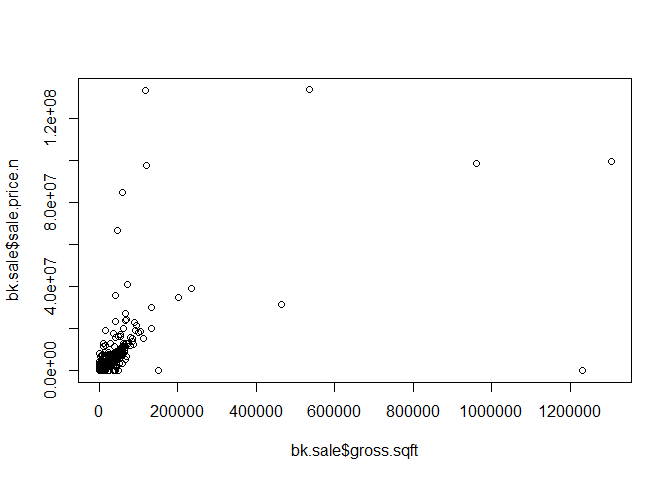
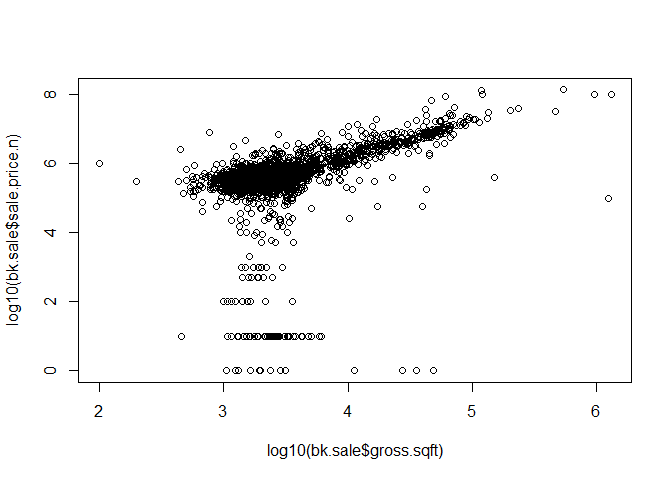
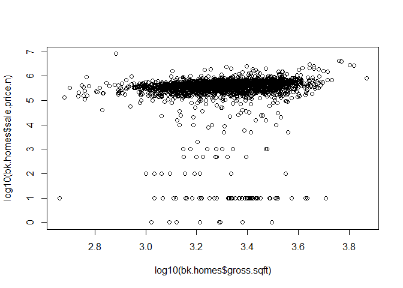
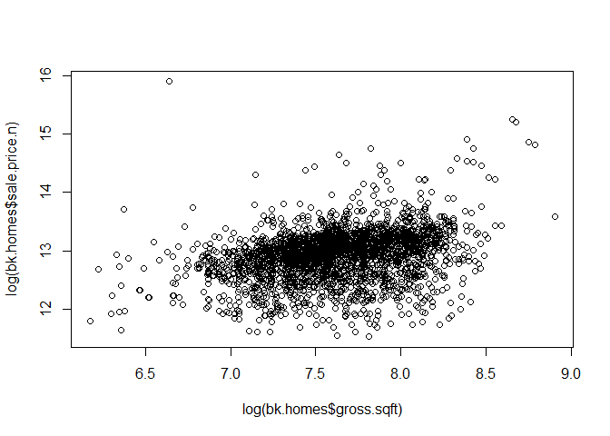

# PropertyRollingSaleData
Vivek Bejugama, Brandon Lawrence, Jack Imburgia  
October 16, 2016  

### Location of the data
The data can be found at https://www1.nyc.gov/site/finance/taxes/property-rolling-sales-data.page.  Download the Excel file and save it to CSV format.

## Data Clean-up

### Install the plyr packages and load in to R.

```r
library(plyr)
```


### Read the CSV file.

```r
# Change this path to your working directory
setwd("C:\\SASUniversityEdition\\myfolders")
bk <- read.csv("rollingsales_bronx.csv",skip=4,header=TRUE)
```

### Do a prelimary check of the data for missing values or outliers.

```r
head(bk)
```

```
##   BOROUGH              NEIGHBORHOOD
## 1       2 BATHGATE                 
## 2       2 BATHGATE                 
## 3       2 BATHGATE                 
## 4       2 BATHGATE                 
## 5       2 BATHGATE                 
## 6       2 BATHGATE                 
##                        BUILDING.CLASS.CATEGORY TAX.CLASS.AT.PRESENT BLOCK
## 1 01  ONE FAMILY DWELLINGS                                        1  3035
## 2 01  ONE FAMILY DWELLINGS                                        1  3043
## 3 01  ONE FAMILY DWELLINGS                                        1  3048
## 4 01  ONE FAMILY DWELLINGS                                        1  3053
## 5 01  ONE FAMILY DWELLINGS                                        1  3053
## 6 02  TWO FAMILY DWELLINGS                                        1  2900
##   LOT EASE.MENT BUILDING.CLASS.AT.PRESENT
## 1   2        NA                        S1
## 2  55        NA                        A1
## 3  27        NA                        A1
## 4  86        NA                        S0
## 5 102        NA                        A1
## 6  61        NA                        S2
##                                     ADDRESS APARTMENT.NUMBER ZIP.CODE
## 1 441 EAST 178 STREET                                           10457
## 2 1948 BATHGATE AVENUE                                          10457
## 3 538 EAST 182 STREET                                           10457
## 4 2364 WASHINGTON AVENUE                                        10458
## 5 2329 BASSFORD AVENUE                                          10458
## 6 406 EAST TREMONT AVENUE                                       10457
##   RESIDENTIAL.UNITS COMMERCIAL.UNITS TOTAL.UNITS LAND.SQUARE.FEET
## 1                 1                1           2            1,287
## 2                 1                0           1            2,356
## 3                 1                0           1            1,209
## 4                 1                2           3            1,911
## 5                 1                0           1              919
## 6                 2                1           3            1,855
##   GROSS.SQUARE.FEET YEAR.BUILT TAX.CLASS.AT.TIME.OF.SALE
## 1             2,528       1899                         1
## 2             2,047       1901                         1
## 3             1,048       1901                         1
## 4             4,080       1931                         1
## 5             1,248       1901                         1
## 6             4,452       1931                         1
##   BUILDING.CLASS.AT.TIME.OF.SALE SALE.PRICE  SALE.DATE
## 1                             S1       -    12/18/2015
## 2                             A1    220,000  6/22/2016
## 3                             A1       -     3/22/2016
## 4                             S0       -     3/17/2016
## 5                             A1       -     1/19/2016
## 6                             S2    399,000  2/24/2016
```

```r
summary(bk)
```

```
##     BOROUGH                     NEIGHBORHOOD 
##  Min.   :2   RIVERDALE                : 657  
##  1st Qu.:2   SOUNDVIEW                : 472  
##  Median :2   PARKCHESTER              : 430  
##  Mean   :2   WILLIAMSBRIDGE           : 410  
##  3rd Qu.:2   MORRISANIA/LONGWOOD      : 378  
##  Max.   :2   THROGS NECK              : 360  
##              (Other)                  :4143  
##                                  BUILDING.CLASS.CATEGORY
##  02  TWO FAMILY DWELLINGS                    :1931      
##  01  ONE FAMILY DWELLINGS                    :1164      
##  10  COOPS - ELEVATOR APARTMENTS             : 968      
##  03  THREE FAMILY DWELLINGS                  : 706      
##  07  RENTALS - WALKUP APARTMENTS             : 530      
##  13  CONDOS - ELEVATOR APARTMENTS            : 372      
##  (Other)                                     :1179      
##  TAX.CLASS.AT.PRESENT     BLOCK           LOT         EASE.MENT     
##  1      :3833         Min.   :2268   Min.   :   1.0   Mode:logical  
##  2      :1797         1st Qu.:3260   1st Qu.:  22.0   NA's:6850     
##  4      : 569         Median :4092   Median :  47.0                 
##  2A     : 251         Mean   :4173   Mean   : 285.8                 
##  1B     : 187         3rd Qu.:5044   3rd Qu.: 118.0                 
##  2B     : 113         Max.   :5957   Max.   :7501.0                 
##  (Other): 100                                                       
##  BUILDING.CLASS.AT.PRESENT
##  D4     : 968             
##  B1     : 904             
##  C0     : 706             
##  B2     : 567             
##  A5     : 462             
##  A1     : 427             
##  (Other):2816             
##                                       ADDRESS         APARTMENT.NUMBER
##  2287 JOHNSON AVENUE                      :  12               :6336   
##  640 WEST 237 STREET                      :  11   4B          :  12   
##  1560 UNIONPORT ROAD                      :   6   5F          :  10   
##  1569 METROPOLITAN AVENUE                 :   6   6A          :  10   
##  1705 PURDY STREET                        :   6   6C          :  10   
##  2140 HOLLAND AVENUE                      :   6   1C          :   9   
##  (Other)                                  :6803   (Other)     : 463   
##     ZIP.CODE     RESIDENTIAL.UNITS  COMMERCIAL.UNITS   TOTAL.UNITS      
##  Min.   :    0   Min.   :   0.000   Min.   : 0.0000   Min.   :   0.000  
##  1st Qu.:10460   1st Qu.:   0.000   1st Qu.: 0.0000   1st Qu.:   1.000  
##  Median :10463   Median :   1.000   Median : 0.0000   Median :   2.000  
##  Mean   :10356   Mean   :   3.929   Mean   : 0.1727   Mean   :   4.105  
##  3rd Qu.:10469   3rd Qu.:   2.000   3rd Qu.: 0.0000   3rd Qu.:   2.000  
##  Max.   :10803   Max.   :1153.000   Max.   :15.0000   Max.   :1153.000  
##                                                                         
##  LAND.SQUARE.FEET GROSS.SQUARE.FEET   YEAR.BUILT  
##   -     :1568      -     :1959      Min.   :   0  
##  2,500  : 691     2,400  :  82      1st Qu.:1916  
##  2,000  : 166     2,000  :  32      Median :1931  
##  5,000  : 147     3,300  :  32      Mean   :1741  
##  2,375  : 146     1,600  :  31      3rd Qu.:1960  
##  1,800  :  86     2,160  :  29      Max.   :2015  
##  (Other):4046     (Other):4685                    
##  TAX.CLASS.AT.TIME.OF.SALE BUILDING.CLASS.AT.TIME.OF.SALE   SALE.PRICE  
##  Min.   :1.000             D4     : 968                    -     :1786  
##  1st Qu.:1.000             B1     : 904                   10     :  67  
##  Median :1.000             C0     : 706                   400,000:  58  
##  Mean   :1.566             B2     : 566                   300,000:  55  
##  3rd Qu.:2.000             A5     : 461                   450,000:  55  
##  Max.   :4.000             A1     : 428                   150,000:  47  
##                            (Other):2817                   (Other):4782  
##       SALE.DATE   
##  10/28/2015:  63  
##  3/1/2016  :  60  
##  12/22/2015:  58  
##  6/30/2016 :  58  
##  9/9/2015  :  58  
##  10/14/2015:  53  
##  (Other)   :6500
```

```r
str(bk)
```

```
## 'data.frame':	6850 obs. of  21 variables:
##  $ BOROUGH                       : int  2 2 2 2 2 2 2 2 2 2 ...
##  $ NEIGHBORHOOD                  : Factor w/ 37 levels "BATHGATE                 ",..: 1 1 1 1 1 1 1 1 1 1 ...
##  $ BUILDING.CLASS.CATEGORY       : Factor w/ 37 levels "01  ONE FAMILY DWELLINGS                    ",..: 1 1 1 1 1 2 2 2 2 2 ...
##  $ TAX.CLASS.AT.PRESENT          : Factor w/ 10 levels "  ","1","1A",..: 2 2 2 2 2 2 2 2 2 2 ...
##  $ BLOCK                         : int  3035 3043 3048 3053 3053 2900 2912 2912 2929 3030 ...
##  $ LOT                           : int  2 55 27 86 102 61 117 118 137 149 ...
##  $ EASE.MENT                     : logi  NA NA NA NA NA NA ...
##  $ BUILDING.CLASS.AT.PRESENT     : Factor w/ 109 levels "  ","A0","A1",..: 91 3 3 90 3 92 10 10 10 92 ...
##  $ ADDRESS                       : Factor w/ 6243 levels "1 ANGELAS PLACE                          ",..: 4525 1781 4843 2427 2382 4242 1149 1153 4851 2294 ...
##  $ APARTMENT.NUMBER              : Factor w/ 228 levels "            ",..: 1 1 1 1 1 1 1 1 1 1 ...
##  $ ZIP.CODE                      : int  10457 10457 10457 10458 10458 10457 10457 10457 10457 10457 ...
##  $ RESIDENTIAL.UNITS             : int  1 1 1 1 1 2 2 2 2 2 ...
##  $ COMMERCIAL.UNITS              : int  1 0 0 2 0 1 0 0 0 1 ...
##  $ TOTAL.UNITS                   : int  2 1 1 3 1 3 2 2 2 3 ...
##  $ LAND.SQUARE.FEET              : Factor w/ 1879 levels " -   ","1,000",..: 55 727 35 305 1868 280 533 533 1304 162 ...
##  $ GROSS.SQUARE.FEET             : Factor w/ 2038 levels " -   ","1,000",..: 925 673 12 1577 81 1624 872 872 869 1314 ...
##  $ YEAR.BUILT                    : int  1899 1901 1901 1931 1901 1931 1993 1993 1995 1931 ...
##  $ TAX.CLASS.AT.TIME.OF.SALE     : int  1 1 1 1 1 1 1 1 1 1 ...
##  $ BUILDING.CLASS.AT.TIME.OF.SALE: Factor w/ 108 levels "A0","A1","A2",..: 90 2 2 89 2 91 9 9 9 91 ...
##  $ SALE.PRICE                    : Factor w/ 1576 levels " -   ","1","1,000",..: 1 425 1 1 1 866 1077 1 1039 1198 ...
##  $ SALE.DATE                     : Factor w/ 305 levels "1/1/2016","1/11/2016",..: 85 221 141 136 9 119 160 80 245 131 ...
```

### Clean/format the data with regular expressions. The pattern "[^[:digit:]]" refers to members of the variable name that start with digits. We use the gsub command to replace them with a blank space. We create a new variable that is a "clean' version of sale.price. And sale.price.n is numeric, not a factor.

```r
bk$SALE.PRICE.N <- as.numeric(gsub("[^[:digit:]]","", bk$SALE.PRICE))
count(is.na(bk$SALE.PRICE.N))
```

```
##       x freq
## 1 FALSE 5064
## 2  TRUE 1786
```

### Make all variable names lower case.

```r
names(bk) <- tolower(names(bk)) 
```

### Get rid of leading digits.

```r
bk$gross.sqft <- as.numeric(gsub("[^[:digit:]]","", bk$gross.square.feet))
bk$land.sqft <- as.numeric(gsub("[^[:digit:]]","", bk$land.square.feet))
bk$year.built <- as.numeric(as.character(bk$year.built))
```

### Keep only the actual sales.

```r
bk.sale <- bk[bk$sale.price.n!=0,]
plot(bk.sale$gross.sqft,bk.sale$sale.price.n)
```

<!-- -->

```r
plot(log10(bk.sale$gross.sqft),log10(bk.sale$sale.price.n))
```

<!-- -->

### Let's look at 1-, 2-, and 3-family homes.

```r
bk.homes <- bk.sale[which(grepl("FAMILY",bk.sale$building.class.category)),]
dim(bk.homes)
```

```
## [1] 2797   24
```

```r
plot(log10(bk.homes$gross.sqft),log10(bk.homes$sale.price.n))
```

<!-- -->

```r
summary(bk.homes[which(bk.homes$sale.price.n<100000),])
```

```
##     borough                     neighborhood
##  Min.   :2   BAYCHESTER               :21   
##  1st Qu.:2   BRONXDALE                :10   
##  Median :2   SOUNDVIEW                :10   
##  Mean   :2   WILLIAMSBRIDGE           : 9   
##  3rd Qu.:2   MORRISANIA/LONGWOOD      : 8   
##  Max.   :2   SCHUYLERVILLE/PELHAM BAY : 8   
##              (Other)                  :71   
##                                  building.class.category
##  02  TWO FAMILY DWELLINGS                    :65        
##  01  ONE FAMILY DWELLINGS                    :48        
##  03  THREE FAMILY DWELLINGS                  :24        
##  04  TAX CLASS 1 CONDOS                      : 0        
##  05  TAX CLASS 1 VACANT LAND                 : 0        
##  06  TAX CLASS 1 - OTHER                     : 0        
##  (Other)                                     : 0        
##  tax.class.at.present     block           lot         ease.ment     
##  1      :137          Min.   :2285   Min.   :   1.0   Mode:logical  
##         :  0          1st Qu.:3283   1st Qu.:  20.0   NA's:137      
##  1A     :  0          Median :4531   Median :  42.0                 
##  1B     :  0          Mean   :4244   Mean   : 111.1                 
##  2      :  0          3rd Qu.:4979   3rd Qu.:  72.0                 
##  2A     :  0          Max.   :5870   Max.   :2294.0                 
##  (Other):  0                                                        
##  building.class.at.present                                      address   
##  B1     :34                2180 LIGHT STREET                        :  2  
##  C0     :24                3230 JOHNSON AVENUE                      :  2  
##  A5     :18                4465 PARK AVE                            :  2  
##  B2     :16                1010 QUINCY AVENUE                       :  1  
##  A1     :15                1110 EAST 213 STREET                     :  1  
##  B3     :10                1139 VIRGINIA AVENUE                     :  1  
##  (Other):20                (Other)                                  :128  
##      apartment.number    zip.code     residential.units commercial.units
##              :137     Min.   :10451   Min.   :1.000     Min.   :0.0000  
##  1           :  0     1st Qu.:10461   1st Qu.:1.000     1st Qu.:0.0000  
##  1-Jan       :  0     Median :10466   Median :2.000     Median :0.0000  
##  1-Mar       :  0     Mean   :10465   Mean   :1.825     Mean   :0.0292  
##  1-Nov       :  0     3rd Qu.:10469   3rd Qu.:2.000     3rd Qu.:0.0000  
##  1-Sep       :  0     Max.   :10473   Max.   :3.000     Max.   :1.0000  
##  (Other)     :  0                                                       
##   total.units    land.square.feet gross.square.feet   year.built  
##  Min.   :1.000   2,500  : 17      1,600  :  3       Min.   :1800  
##  1st Qu.:1.000   2,000  :  5      1,084  :  2       1st Qu.:1920  
##  Median :2.000   1,710  :  4      1,152  :  2       Median :1930  
##  Mean   :1.854   3,125  :  3      1,312  :  2       Mean   :1941  
##  3rd Qu.:2.000   4,000  :  3      1,497  :  2       3rd Qu.:1965  
##  Max.   :3.000   4,750  :  3      2,000  :  2       Max.   :2012  
##                  (Other):102      (Other):124                     
##  tax.class.at.time.of.sale building.class.at.time.of.sale   sale.price
##  Min.   :1                 B1     :34                     10     :51  
##  1st Qu.:1                 C0     :24                     1,000  : 9  
##  Median :1                 A5     :18                     100    : 9  
##  Mean   :1                 B2     :16                     1      : 8  
##  3rd Qu.:1                 A1     :15                     500    : 7  
##  Max.   :1                 B3     :10                     80,000 : 5  
##                            (Other):20                     (Other):48  
##       sale.date    sale.price.n     gross.sqft     land.sqft    
##  6/29/2016 :  5   Min.   :    1   Min.   : 458   Min.   :  297  
##  12/11/2015:  4   1st Qu.:   10   1st Qu.:1554   1st Qu.: 1975  
##  9/1/2015  :  4   Median :  500   Median :2115   Median : 2500  
##  10/30/2015:  3   Mean   :17020   Mean   :2172   Mean   : 2805  
##  3/30/2016 :  3   3rd Qu.:23500   3rd Qu.:2650   3rd Qu.: 3075  
##  8/8/2016  :  3   Max.   :97000   Max.   :5096   Max.   :14175  
##  (Other)   :115
```

### Remove outliers that seem like they weren't actual sales.

```r
bk.homes$outliers <- (log10(bk.homes$sale.price.n) <=5) + 0
bk.homes <- bk.homes[which(bk.homes$outliers==0),]
plot(log(bk.homes$gross.sqft),log(bk.homes$sale.price.n))
```

<!-- -->

